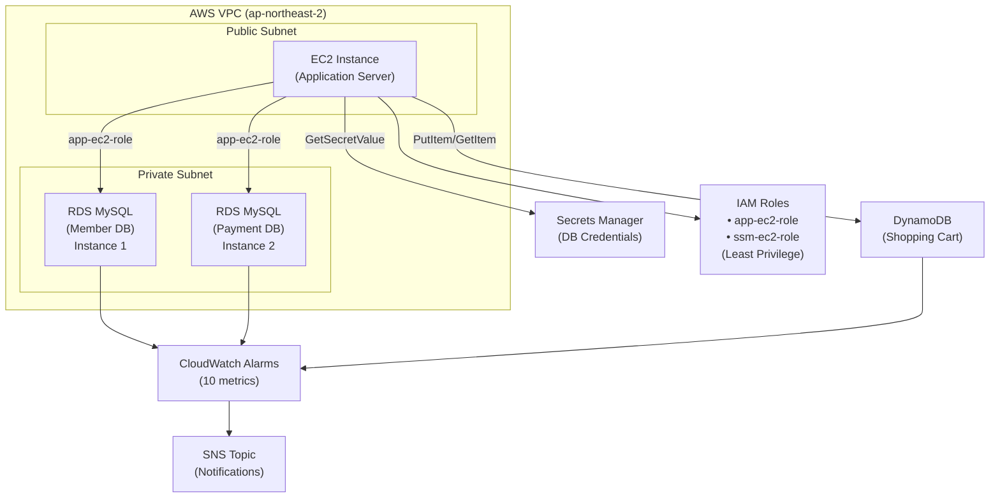

# ecommerce-db-separation

이커머스 서비스에서 **데이터베이스 분리 아키텍처의 필요성과 효과**를 실증하는 포트폴리오 프로젝트입니다.

회원 정보, 결제 정보, 장바구니를 **의도적으로 분리된 DB에 저장**하고, 각 DB 장애 시나리오를 재현·대응하는 과정을 통해 **Fault Isolation** 설계의 가치를 입증합니다.

## 📌 왜 UI/UX가 아닌 운영 역량에 집중했는가

이 프로젝트는 사용자에게 보여지는 화면(UI/UX)이 아니라, 장애가 발생했을 때 시스템이 어떻게 반응하고, 이를 어떻게 감지·진단·복구하는지를 증명하는 데 목적을 두었습니다.
실무에서 인프라 엔지니어의 역할은 서비스 화면을 만드는 것이 아니라, 화면 뒤에서 서비스가 멈추지 않도록 구조를 설계하고 지키는 것입니다. 이 프로젝트는 그 역할을 그대로 재현하기 위해 다음 기준으로 설계했습니다.
```
✓ 회원 / 결제 / 장바구니 데이터를 물리적으로 분리 → 장애 발생 시 영향 범위를 최소화
✓ 의도적으로 장애를 재현 (보안그룹 차단, DB 연결 실패, IAM 권한 거부, EC2 장애) → 실제 운영 상황에서 발생 가능한 문제를 사전에 검증
✓ 각 장애에 대한 Runbook 작성 → 장애 발생 시 "무엇을 확인하고, 어떻게 대응할지"를 문서화
```
즉, 이 프로젝트의 산출물은 예쁜 화면이 아니라 "이 시스템은 왜 이렇게 설계됐고, 문제가 생기면 어떻게 대응하는가"에 대한 증거입니다.

---

## 🎯 프로젝트 배경

### 단일 DB의 문제점
```
회원 DB 장애 → 회원 기능 + 결제 기능 + 장바구니 모두 사용 불가 ❌
```

### DB 분리 설계의 이점
```
회원 DB 장애 → 회원 기능만 사용 불가
            → 결제, 장바구니는 독립적으로 작동 ✓
```

---
## 🏗️ 아키텍처



---

### 핵심 설계 결정

| 계층 | 기술 | 이유 |
|---|---|---|
| **회원 데이터** | RDS MySQL (별도 인스턴스) | 보안 경계 분리, 접근 통제 |
| **결제 데이터** | RDS MySQL (별도 인스턴스) | 규제 준수, 독립적 복구 |
| **장바구니** | DynamoDB | 높은 동시성, Key-Value 특성 |
| **자격증명 관리** | Secrets Manager | 인증 정보 안전 저장 |
| **인프라 코드** | Terraform | 재현 가능성, 버전 관리 |

---

## 📂 프로젝트 구조

```
ecommerce-db-separation/
├── terraform/              # 인프라 코드
│   ├── provider.tf
│   ├── vpc.tf
│   ├── security_group.tf
│   ├── rds.tf
│   ├── dynamodb.tf
│   ├── iam.tf
│   ├── secrets_manager.tf
│   ├── cloudwatch.tf
│   ├── variables.tf
│   └── outputs.tf
│
├── fault-scenarios/        # 장애 시뮬레이션 + 런북
│   ├── config.sh
│   ├── 01_member_db_failure.sh
│   ├── 02_payment_db_failure.sh
│   ├── 03_dynamodb_failure.sh
│   ├── 04_ec2_failure.sh
│   ├── runbook-01-member-db.md
│   ├── runbook-02-payment-db.md
│   ├── runbook-03-dynamodb-iam.md
│   └── runbook-04-ec2-failure.md
│
├── docs/                   # 검증 스크린샷
│   └── (각 시나리오별 증거 이미지)
│
└── README.md              # 이 파일
```

---

## 🚀 배포 방법

### 사전 요구사항
- AWS 계정 (ap-northeast-2 리전)
- Terraform 1.0+
- AWS CLI 설정 완료

### 인프라 배포
```bash
cd terraform

# 변수 정의 (선택사항)
cp terraform.tfvars.example terraform.tfvars

# Terraform 초기화
terraform init

# 배포 계획 확인
terraform plan

# 배포 실행
terraform apply
```

### 배포 결과
```
✓ VPC, Subnet, Route Table 생성
✓ EC2 인스턴스 실행
✓ RDS MySQL (회원 DB, 결제 DB) 생성
✓ DynamoDB 테이블 생성
✓ Security Group (격리된 접근 제어)
✓ IAM 역할 (최소 권한)
✓ CloudWatch 알람 10종 구성
✓ SNS 토픽 (알림)
```

---

## 🧪 장애 시나리오 및 대응 가이드

각 시나리오는 **증상 감지 → 진단 → 복구 → 검증**의 과정을 거칩니다.

### 1. 회원 DB 연결 실패
**증상**: 회원 로그인 불가 (결제와 장바구니는 정상)

📖 [런북 보기](fault-scenarios/runbook-01-member-db.md)

```bash
# 시뮬레이션 실행
cd fault-scenarios
bash 01_member_db_failure.sh
```

### 2. 결제 DB 연결 실패
**증상**: 결제 처리 불가 (회원 정보와 장바구니는 정상)

📖 [런북 보기](fault-scenarios/runbook-02-payment-db.md)

```bash
cd fault-scenarios
bash 02_payment_db_failure.sh
```

### 3. DynamoDB IAM 권한 실패
**증상**: 장바구니 상품 추가 불가 (회원/결제는 정상)

📖 [런북 보기](fault-scenarios/runbook-03-dynamodb-iam.md)

```bash
cd fault-scenarios
bash 03_dynamodb_failure.sh
```

### 4. EC2 인스턴스 장애
**증상**: 모든 서비스 접근 불가 (인프라 차원의 장애)

📖 [런북 보기](fault-scenarios/runbook-04-ec2-failure.md)

```bash
cd fault-scenarios
bash 04_ec2_failure.sh
```

---

## 📊 주요 학습 포인트

### 1. **Fault Isolation의 실증**
- 한 DB의 장애가 다른 DB에 영향을 주지 않음
- EC2 장애만 전체 서비스에 영향 → 이것이 "단일 장애점(SPOF)" 제거의 중요성

### 2. **IAM 최소 권한 원칙**
```
✓ SSM role: EC2 접속만 가능 (Secrets Manager 접근 불가)
✓ app-ec2-role: DynamoDB만 접근 (RDS 직접 접근 불가)
✓ 자격증명: Secrets Manager에서 관리 (파일 저장 X)
```
**효과**: 권한 침해/실수가 전체 인프라에 영향을 주지 않음

### 3. **모니터링 설계의 중요성**
- CloudWatch 알람 10종 (DB 연결 실패, IAM 권한 실패, EC2 상태 등)
- SNS 알림으로 즉각 감지
- RTO(복구 시간): 3-10분

### 4. **Terraform으로 인프라 재현 가능성**
- 배포 1회 → 모든 리소스 자동 생성
- 파괴 1회 → 비용 최소화
- 변경사항 버전 관리

### 5. **데이터 보안**
- RDS 자격증명: Secrets Manager 관리
- EC2 접근: Secrets Manager 접근 불가 (의도적 제한)
- MySQL 연결: 네트워크 기반 차단 (Security Group)

---

## 💡 설계 결정 근거

### "왜 RDS를 2개 만들었나?"
```
회원 DB와 결제 DB를 합치면:
  - 회원 정보 손실 → 결제 기록도 조회 불가
  - 하나의 장애 → 전체 장애
  - 스케일링 불가 (읽기/쓰기 패턴이 다름)

분리하면:
  - 각각 독립적으로 백업/복구 가능 ✓
  - 장애 영향 범위 최소화 ✓
  - 각 DB에 맞는 설정 적용 가능 ✓
```

### "왜 DynamoDB를 썼나?"
```
RDS MySQL을 3개 쓸 수도 있지만:
  - 장바구니는 세션처럼 임시 데이터
  - 고속 읽기/쓰기 필요 (동시성 높음)
  - ACID 트랜잭션 불필요
  
→ DynamoDB가 더 적합 (비용, 성능, 관리)
```

### "왜 Secrets Manager를 썼나?"
```
DB 자격증명을 코드에 넣으면:
  - GitHub 노출 위험
  - 로컬/운영 환경 분리 어려움
  - 회전(rotation) 불가능

Secrets Manager:
  - 중앙집중식 관리 ✓
  - 자동 회전 가능 ✓
  - IAM으로 접근 통제 ✓
```

---

## 🔧 주의사항

### Terraform State 관리
```bash
# .gitignore에 추가 (자격증명 노출 방지)
terraform.tfstate
terraform.tfstate.backup
*.tfvars
```

### 비용 최소화
```bash
# 테스트 후 반드시 리소스 삭제
terraform destroy

# RDS 프리티어 요금:
# - t3.micro: 월 ~$15 (기존 프리티어 제외)
# - DynamoDB: 온디맨드 모드 (~$1/월)
```

### 보안 주의
```
⚠️ AWS 자격증명 절대 노출 금지
⚠️ Terraform variables 파일 .gitignore 추가
⚠️ GitHub Private repository 권장
```

---

## 📈 다음 단계 (선택사항)

- [ ] Auto Scaling Group + Load Balancer 추가
- [ ] CloudWatch 대시보드 구성
- [ ] SNS → Slack 알림 연동
- [ ] RDS 읽기 복제본(Read Replica) 추가
- [ ] Prometheus + Grafana 연동

---

## 📝 참고 자료

- [AWS RDS 보안](https://docs.aws.amazon.com/AmazonRDS/latest/UserGuide/SecurityGroups.html)
- [DynamoDB 권한 관리](https://docs.aws.amazon.com/amazondynamodb/latest/developerguide/access-control-overview.html)
- [IAM 최소 권한](https://docs.aws.amazon.com/IAM/latest/UserGuide/best-practices.html)
- [Terraform Best Practices](https://www.terraform.io/docs/language/settings/index.html)

---

## 📧 Contact

- GitHub: [HyoGyeong-Yu](https://github.com/HyoGyeong-Yu)
- Portfolio: ecommerce-db-separation
