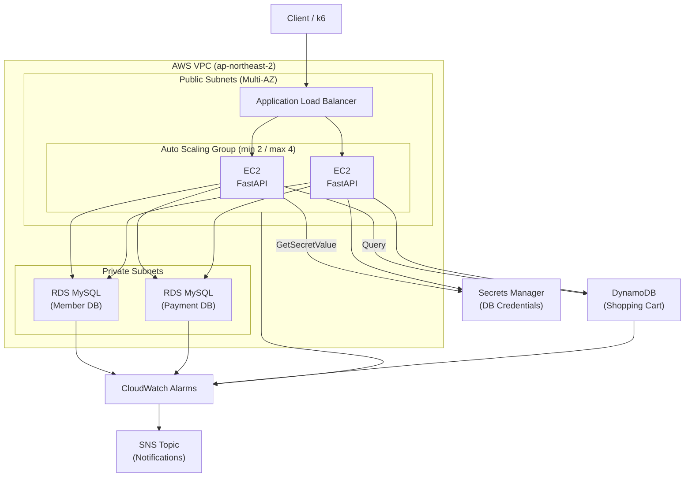

# ecommerce-db-separation

[](https://github.com/HyoGyeong-Yu/ecommerce-db-separation/actions/workflows/terraform-ci.yml)

이커머스 서비스에서 **데이터베이스 분리 아키텍처의 필요성과 효과**를 실증하는 포트폴리오 프로젝트입니다.

회원 정보, 결제 정보, 장바구니를 **의도적으로 분리된 DB에 저장**하고, 실제 HTTP 트래픽이 흐르는 상태에서 현실적인 장애를 주입해 **감지(MTTD) → 진단 → 복구(MTTR) → 재발 방지**의 전 과정을 숫자로 증명합니다.

## 📌 왜 UI/UX가 아닌 운영 역량에 집중했는가

이 프로젝트는 사용자에게 보여지는 화면(UI/UX)이 아니라, 장애가 발생했을 때 시스템이 어떻게 반응하고, 이를 어떻게 감지·진단·복구하는지를 증명하는 데 목적을 두었습니다.
실무에서 인프라 엔지니어의 역할은 서비스 화면을 만드는 것이 아니라, 화면 뒤에서 서비스가 멈추지 않도록 구조를 설계하고 지키는 것입니다. 이 프로젝트는 그 역할을 그대로 재현하기 위해 다음 기준으로 설계했습니다.
```
- 회원 / 결제 / 장바구니 데이터를 물리적으로 분리 → 장애 발생 시 영향 범위를 최소화
- FastAPI 실서비스 계층 + k6 부하 위에서 현실적인 장애를 재현
  (커넥션 슬롯 고갈, 슬로우 쿼리 폭주, DynamoDB 스로틀링)
- 모든 장애에 MTTD/MTTR 실측 타임라인 기록 → "몇 분 만에 감지하고 복구했는가"를 숫자로 증명
- 각 장애에 대한 Runbook 작성 → 실수와 교훈까지 포함해 문서화
```
즉, 이 프로젝트의 산출물은 예쁜 화면이 아니라 "이 시스템은 왜 이렇게 설계됐고, 문제가 생기면 어떻게 대응하는가"에 대한 증거입니다.

---

## 🔄 v1 → v2: 피드백 기반 개선

초기 버전(v1)은 보안그룹 차단 같은 **인위적인 장애 재현**에 머물러 "사전에 준비된 시연"이라는 피드백을 받았습니다. 이를 다음과 같이 개선했습니다.

| | v1 | v2 (현재) |
|---|---|---|
| 애플리케이션 | 없음 (mysql CLI 확인) | FastAPI 3-도메인 API + k6 부하 |
| 장애 유형 | SG 차단, IAM 거부 (인위적) | 커넥션 슬롯 고갈, 슬로우 쿼리, 스로틀링 (현실형) |
| 단일 장애점 | EC2 1대 (SPOF) | ALB + Auto Scaling (2~4대, 자기치유) |
| 복구 지표 | "RTO 3~10분" (목표값) | MTTD/MTTR 실측 타임라인 (측정값) |
| 보안 검증 | 수동 확인 | tfsec 자동 스캔 (CI 통합) |

v1 시나리오는 [`fault-scenarios-legacy/`](fault-scenarios-legacy/)에 보존되어 있습니다.

---

## 🛡️ 보안 자동화: 도구로 발견하고, 판단으로 처리한다

Terraform 코드를 푸시할 때마다 GitHub Actions가 `fmt` → `validate` → `tfsec` 보안 스캔을 자동 실행합니다. 검문소를 통과하지 못한 코드는 main에 병합되지 않습니다.

첫 스캔에서 **27개의 잠재적 문제**(CRITICAL 1, HIGH 9, MEDIUM 8, LOW 9)가 발견됐고, 이를 두 갈래로 나눠 처리했습니다.

**실제 수정 (10개)** — 무료로 즉시 개선 가능한 항목
- ALB invalid header 차단, EC2 IMDSv2 강제(자격증명 탈취 방어)
- DynamoDB 저장 시 암호화, RDS 백업 보존 기간 7일, SG 설명 명시

**사유를 명시한 예외 (12개)** — 끄는 게 아니라 "왜 안 하는지"를 코드에 기록
- HTTPS 미적용 → 도메인/ACM 인증서 부재 (실서비스라면 443 리스너 + 리다이렉트)
- RDS 스토리지 암호화 → 기존 인스턴스는 재생성 필요, 실측 데이터 보존 위해 스냅샷 마이그레이션 계획으로 대체
- IAM DB 인증 → Secrets Manager 방식 채택 (설계 선택)
- ALB 퍼블릭 노출 → 인터넷 대면 로드밸런서가 설계 의도

LOW 9건 중 4건(보안그룹 설명)은 수정하고, 나머지 5건은 정보성으로 판단해 **심각도 임계값(MEDIUM 이상)**을 두어 빌드를 막지 않도록 설정했습니다.
---

## 🏗️ 아키텍처


```mermaid
graph TB
    Client["Client / k6"] --> ALB["Application Load Balancer"]

    subgraph VPC["AWS VPC (ap-northeast-2)"]
        subgraph PublicSubnet["Public Subnets (Multi-AZ)"]
            ALB
            subgraph ASG["Auto Scaling Group (min 2 / max 4)"]
                EC2A["EC2<br/>FastAPI"]
                EC2B["EC2<br/>FastAPI"]
            end
        end

        subgraph PrivateSubnet["Private Subnets"]
            MemberDB["RDS MySQL<br/>(Member DB)"]
            PaymentDB["RDS MySQL<br/>(Payment DB)"]
        end

        ALB --> EC2A
        ALB --> EC2B
        EC2A --> MemberDB
        EC2A --> PaymentDB
        EC2B --> MemberDB
        EC2B --> PaymentDB
    end

    DynamoDB["DynamoDB<br/>(Shopping Cart)"]
    SecretsManager["Secrets Manager<br/>(DB Credentials)"]

    EC2A -->|GetSecretValue| SecretsManager
    EC2A -->|Query| DynamoDB
    EC2B --> SecretsManager
    EC2B --> DynamoDB

    CloudWatch["CloudWatch Alarms"]
    SNS["SNS Topic<br/>(Notifications)"]

    MemberDB --> CloudWatch
    PaymentDB --> CloudWatch
    DynamoDB --> CloudWatch
    ASG --> CloudWatch
    CloudWatch --> SNS
```

### 핵심 설계 결정

| 계층 | 기술 | 이유 |
|---|---|---|
| **회원 데이터** | RDS MySQL (별도 인스턴스) | 보안 경계 분리, 접근 통제 |
| **결제 데이터** | RDS MySQL (별도 인스턴스) | 규제 준수, 독립적 복구 |
| **장바구니** | DynamoDB | 높은 동시성, Key-Value 특성 |
| **애플리케이션** | FastAPI on ALB + ASG | SPOF 제거, 자기치유, 자동 확장 |
| **자격증명 관리** | Secrets Manager | 인증 정보 안전 저장 |
| **인프라 코드** | Terraform | 재현 가능성, 버전 관리 (복구도 IaC로 수행) |

---

## 📂 프로젝트 구조

```
ecommerce-db-separation/
├── terraform/               # 인프라 코드 (VPC, ALB/ASG, RDS x2, DynamoDB, 모니터링, SNS)
│
├── app/                     # FastAPI 애플리케이션
│   ├── main.py              #   /members, /payments, /cart, /health — 도메인별 독립 DB 사용
│   ├── seed.py              #   초기 데이터 시딩
│   └── requirements.txt
│
├── load-test/               # k6 부하 테스트
│   └── scale-test.js        #   스케일아웃 유발용 시나리오
│
├── fault-scenarios/         # 현실형 장애 시나리오 (v2)
│   ├── config.sh            #   공통 설정 (리소스 ID, 로그 함수)
│   ├── 01_connection_pool.sh
│   ├── 02_slow_query.sh
│   ├── 03_dynamodb_throttle.sh
│   ├── runbook-01-connection-pool.md
│   ├── runbook-02-slow-query.md
│   └── runbook-03-dynamodb-throttle.md
│
├── fault-scenarios-legacy/  # v1 시나리오 보존 (SG 차단, IAM, EC2, Multi-AZ Failover)
│
├── .github/workflows/       # CI — terraform fmt → validate → tfsec
│   └── terraform-ci.yml
│
├── docs/
│   ├── tradeoffs.md         # 분리 설계의 대가 (조회/정합성/비용/운영)
│   ├── improvement-plan.md  # v1 → v2 실행 계획 원본
│   └── screenshots/         # 스토리별 증거 스크린샷
│       ├── api/                      # Phase 1 — API 구축 + k6 검증
│       ├── alb-asg/01-self-healing/  # Phase 2 — 인스턴스 종료 → 자동 복구
│       ├── alb-asg/02-scaling/       # Phase 2 — 부하 → 2→4 증설 → 4→2 복귀
│       ├── fault-01-connection-pool/ # 런북 01과 짝
│       ├── fault-02-slow-query/      # 런북 02와 짝
│       ├── fault-03-dynamodb/        # 런북 03과 짝
│       └── fault-legacy/             # v1 증거
│
└── README.md
```

---

## ✅ 검증 결과 요약

### 1. 실트래픽 위의 장애 격리 (Phase 1)

FastAPI 3개 도메인 API에 k6로 실제 HTTP 트래픽을 흘려 검증했습니다.

```
k6 부하 테스트: 5,130 요청 / 성공률 100% / p95 37.92ms (임계 3000ms)
장애 주입 시: member API만 5xx, payment·cart API는 정상 → 물리 분리로 blast radius 최소화 실증
```

### 2. SPOF 제거 — 자기치유와 자동 확장 (Phase 2)

| 검증 | 결과 |
|---|---|
| 인스턴스 강제 종료 | **약 2분 만에 대체 인스턴스 Healthy** (사람 개입 0) |
| k6 고부하 (CPU 95%) | AlarmHigh 발동 → **2대 → 4대 자동 증설** |
| 부하 종료 | AlarmLow 발동 → **4대 → 2대 자동 복귀** (비용 최적화) |

### 3. 현실형 장애 시나리오 — MTTD/MTTR 실측 (Phase 3~4)

각 시나리오는 **주입 → 감지 → 진단 → 복구 → 재발 방지**의 전 과정을 타임스탬프와 함께 기록했습니다. (2026-08-01 실측, KST)

| # | 시나리오 | MTTD (감지) | MTTR (복구) | 런북 |
|---|---|---|---|---|
| 01 | RDS 커넥션 슬롯 고갈 | **1분 20초** | 약 12분 | [📖](fault-scenarios/runbook-01-connection-pool.md) |
| 02 | 슬로우 쿼리 CPU 급등 | **약 7분** | 2시간 30분 *(원인 인지 후 2분)* | [📖](fault-scenarios/runbook-02-slow-query.md) |
| 03 | DynamoDB 쓰기 스로틀링 | **2분 10초** | **8분 41초** | [📖](fault-scenarios/runbook-03-dynamodb-throttle.md) |

```bash
# 시나리오 실행 (EC2 SSM 세션에서)
cd fault-scenarios
bash 01_connection_pool.sh
bash 02_slow_query.sh
bash 03_dynamodb_throttle.sh
```

**시나리오에서 얻은 진짜 교훈 (런북에 상세 기록):**

- **"장애는 났는데 모니터링이 침묵했다"** — DynamoDB 스로틀링이 실제 발생했지만 알람이 잘못된 메트릭(`ConsumedWriteCapacityUnits`)을 감시하고 있어 감지에 실패. `WriteThrottleEvents >= 1`로 수정 후 재주입으로 감지까지 재검증. → *알람은 만들어둔 것이 아니라 실제 장애로 검증한 것만 신뢰할 수 있다.*
- **"잔여 세션 방치 사고"** — 슬로우 쿼리 시나리오 종료 후 세션 정리를 누락해 CPU 100%가 장시간 지속. 별도 작업 중 지속 알람을 조사하다 발견해 복구. → *시나리오 종료 체크리스트에 잔여 세션 확인 단계를 추가해 스크립트에 반영.*
- **복구도 IaC로** — DynamoDB 용량 복구를 콘솔 조작이 아닌 `terraform apply`로 수행해 state 불일치를 원천 차단.

### 4. 고가용성 (v1에서 검증 완료)

Multi-AZ 자동 Failover: AZ 장애 시 앱 설정 변경 없이 1~2분 내 스탠바이로 자동 전환 — [📖 런북](fault-scenarios-legacy/runbook-05-multiaz-failover.md)

---

## 🚀 배포 방법

### 사전 요구사항
- AWS 계정 (ap-northeast-2 리전)
- Terraform 1.0+
- AWS CLI 설정 완료

### 인프라 배포
```bash
cd terraform
terraform init
terraform plan
terraform apply
```

배포되는 리소스: VPC / ALB + Auto Scaling Group (FastAPI 자동 배포) / RDS MySQL x2 / DynamoDB / Secrets Manager / CloudWatch 알람 + SNS / IAM (최소 권한)

> ⚠️ 재배포 시 `fault-scenarios/config.sh`의 리소스 ID(EC2, SG)를 새 값으로 갱신해야 합니다.

---

## 💡 설계 결정 근거

### "왜 RDS를 2개 만들었나?"
```
회원 DB와 결제 DB를 합치면:
  - 회원 정보 손실 → 결제 기록도 조회 불가
  - 하나의 장애 → 전체 장애
  - 스케일링 불가 (읽기/쓰기 패턴이 다름)

분리하면:
  - 각각 독립적으로 백업/복구 가능 ✓
  - 장애 영향 범위 최소화 ✓  (→ 시나리오 01에서 실증)
  - 각 DB에 맞는 설정 적용 가능 ✓
```

### "왜 DynamoDB를 썼나?"
```
RDS MySQL을 3개 쓸 수도 있지만:
  - 장바구니는 세션처럼 임시 데이터
  - 고속 읽기/쓰기 필요 (동시성 높음)
  - ACID 트랜잭션 불필요

→ DynamoDB가 더 적합 (비용, 성능, 관리)
```

### "왜 Secrets Manager를 썼나?"
```
DB 자격증명을 코드에 넣으면:
  - GitHub 노출 위험
  - 로컬/운영 환경 분리 어려움
  - 회전(rotation) 불가능

Secrets Manager:
  - 중앙집중식 관리 ✓
  - 자동 회전 가능 ✓
  - IAM으로 접근 통제 ✓
```

### "왜 Multi-AZ를 상시로 켜두지 않았나?"
```
Multi-AZ를 상시 활성화하면:
  - 스탠바이 인스턴스 때문에 DB 비용 2배
  - 학습 프로젝트에는 과한 상시 지출

시나리오 검증 시에만 켜면:
  - 자동 failover 동작은 실증 완료 ✓
  - 평소에는 단일 AZ 비용 유지 ✓
  - Terraform 변수 하나로 on/off 재현 가능 ✓

실무 적용 순서:
  - 결제 DB부터 Multi-AZ 도입 (데이터 정합성 최우선)
  - 회원 DB는 읽기 부하 증가 시 Read Replica와 함께 검토
```

---

## 🔧 주의사항

### Terraform State 관리
```bash
# .gitignore에 포함 (자격증명 노출 방지)
*.tfstate
*.tfstate.*
*.tfvars
```

### 비용 최소화
```bash
# 테스트 후 반드시 리소스 삭제
terraform destroy
```

---

## 📈 진행 상황

**완료**
- [x] 트레이드오프 문서 — [`docs/tradeoffs.md`](docs/tradeoffs.md) (크로스 도메인 조회, 트랜잭션 정합성, 비용, 운영 복잡도)
- [x] GitHub Actions CI — `fmt` → `validate` → `tfsec` (MEDIUM 이상 차단)

**진행 중 / 예정**
- [ ] 포트폴리오 웹사이트 (GitHub Pages 이전 예정)
- [ ] 앱 레벨 커넥션 풀 도입 (`DBUtils.PooledDB`) — 설계만 완료, AWS 리소스 삭제로 **실행 검증 미완료**
- [ ] DynamoDB TTL 속성 `expires_at` 실제 기입 (테이블에 TTL은 설정됐으나 앱이 값을 넣지 않음)

---

## 📧 Contact

- GitHub: [HyoGyeong-Yu](https://github.com/HyoGyeong-Yu)
- Portfolio: [ecommerce-db-separation](https://github.com/HyoGyeong-Yu/ecommerce-db-separation)